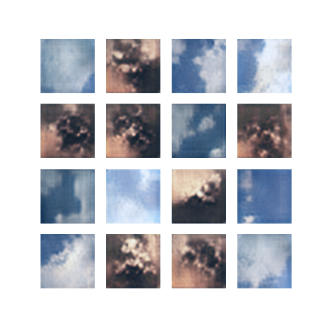

# SWIMNGEN
ML techniques have been used to create SWIMNGEN, a generative model that can be sampled to get 'extra' images from the SWIMSEG and SWINSEG datasets.

Folders Swimseg_aug and Swinseg_aug contain augmented datasets of each, with their cloud maps.

SWIMNGEN allows you to sample images with associated cloud map that are plausably from the SWIMSEG or SWINSEG dataset using class labels. Output samples are visualised in: 

The methodology is discussed in the paper included, and walks through the process of augmenting the data and making SWIMNGEN model.
